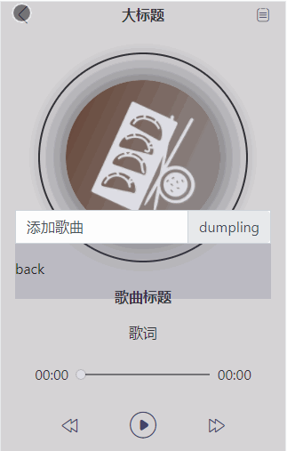

# Music-player --- 可以播放本地音乐的音乐播放器

## 在线预览 [#](http://dongjiawei.work/Dumplings/)

## 效果展示

## 功能说明

-   上传本地歌曲
    -  点击左上按钮，弹出上传表单区域
    -  点击back，将数据添加到播放列表中，并返回播放界面

-   播放列表点击切换
    -   点击右上菜单按钮，弹出播放列表
    -   点击动态切换audio的src并返回播放界面

-   播放器
    -   点击播放按钮，播放歌曲，切换图标，开启动画
    -   点击暂停图标，暂停播放，停止动画

-   进度条
    -   点击定位播放位置

遇到的问题：

-  播放列表如何点击找到对应的的歌曲链接
    -  通过自定义属性data-*作为索引值获取数据

-   如何给上传的歌曲添加到播放列表
    -   通过window.URL.createObjectURL()方法给传入的数据生成一个对应的src
    -   将歌曲名和歌曲链接放入准备好的数据对象中
    -   再播放列表界面获取更新后的数据对象

-   第二次点击上传时会显示添加了多个重复数据
    -   原因是在按钮点击事件中绑定了表单change事件，造成的二次点击重复绑定多个事件，导致数据重复添加，将change事件单独绑定解决该问题

**新增**

歌曲标题动态添加